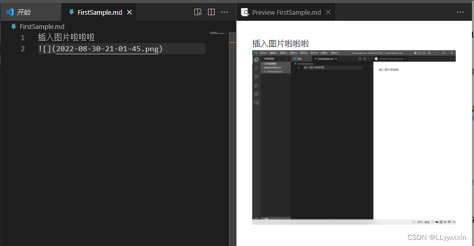

[TOC]
# 一级标题  
## 二级标题   
### 三级标题  
#### 四级标题  
##### 五级标题  
###### 六级标题 

* *斜体*  
  * text1
  * text2  
#分割线
---  
+ **加粗**
  + text3
  + text4

---
代码块

```Go
func main(){
  int a = 0;
  fmt.Println("hello world!")
}
```

---
参考链接： 
https://blog.csdn.net/hyupeng1006/article/details/129590409?utm_medium=distribute.pc_relevant.none-task-blog-2~default~baidujs_baidulandingword~default-0-129590409-blog-153606818.235^v43^pc_blog_bottom_relevance_base1&spm=1001.2101.3001.4242.1&utm_relevant_index=3
  
---
> 这是一段引用的话哦！

1. 一级标题加1个“#”，二级加2个，最多为6级  
2. 换行：两个回车 
   1. test1
   2. test2
   3. test3
   
